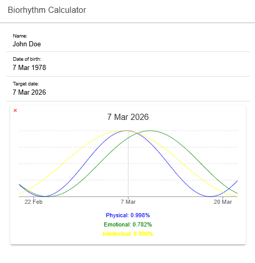

# 🔮 Ionic Biorhythm Calculator

A simple **Ionic + Angular application** that calculates a user's **biorhythm cycles** based on their birth date.

Biorhythms are theoretical cycles that influence **physical, emotional, and intellectual states**.  
This app allows users to input their birth date and see their current cycles represented visually.

🔗 **Live Demo**  
https://ionic-biorhythm-calculator.vercel.app/

---

# 📸 Preview



---

# ✨ Features

- Input birth date to calculate biorhythm cycles
- Visual representation of physical, emotional, and intellectual cycles
- Dynamic chart updates
- Responsive interface
- Simple and intuitive UI

---

# 🛠 Tech Stack

**Frontend**

- Ionic
- Angular
- TypeScript
- HTML
- CSS

**Tooling & Deployment**

- Node.js
- npm
- Vercel

---

# 🧠 What Are Biorhythms?

Biorhythm theory suggests that human life follows three recurring cycles starting from birth:

| Cycle | Duration | Represents |
|------|------|------|
| **Physical** | 23 days | Strength, health, energy |
| **Emotional** | 28 days | Mood, creativity, sensitivity |
| **Intellectual** | 33 days | Memory, logic, analytical thinking |

The app calculates the current position of each cycle using the number of days since birth.

---

# 📁 Project Structure

```
src/
│
├── app
│   ├── components
│   ├── pages
│   └── services
│
├── assets
├── environments
│
├── index.html
└── main.ts
```

The project follows a modular structure separating:

- **UI components**
- **Pages**
- **Logic and services**

---

# 🚀 Run Locally

Clone the repository

```bash
git clone https://github.com/AdrianaAC/ionic-biorhythm-calculator.git
```

Navigate to the project

```bash
cd ionic-biorhythm-calculator
```

Install dependencies

```bash
npm install
```

Start the development server

```bash
ionic serve
```

The application will run at:

```
http://localhost:8100
```

---

# 🎯 Learning Goals

This project was created to practice and explore:

- Ionic mobile-style UI development
- Angular component architecture
- TypeScript usage in frontend frameworks
- Handling user input and dynamic calculations
- Visualizing calculated data

---

# 🚀 Possible Future Improvements

Potential improvements for expanding this project:

- Interactive chart visualization for cycles
- Ability to select and compare multiple dates
- Mobile packaging with **Capacitor**
- Dark mode support
- Save user profiles
- Export biorhythm charts

---

# 👩‍💻 Author

**Adriana Alves**

Frontend Developer passionate about building **clean, interactive, and user-focused applications**.

GitHub  
https://github.com/AdrianaAC

LinkedIn  
https://www.linkedin.com/in/adrianaalves098/

---

⭐ If you found this project interesting, feel free to **star the repository**.
